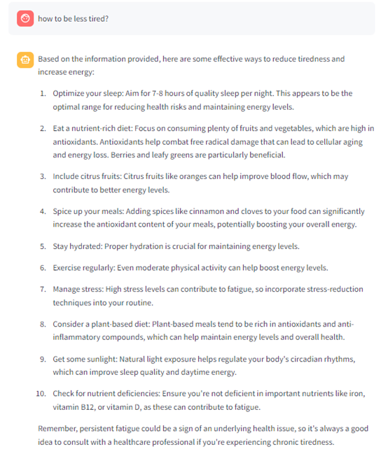

# README

## Project Overview

The project is the creation of a chatbot focused on health and nutrition, based on a Neo4j knowledge base and books on health and nutrition. In the first phase of the project, the information in the books is translated into a knowledge graph using the langchain_experimental (graph_transformers package).

After creating the graph, it is loaded into Neo4j AuraDB, where it can be queried using CYPHER queries. The graph serves as the foundation for a chatbot with an agent that can perform several types of queries:
- RAG-style queries on the base documents
- Complex CYPHER queries on the knowledge graph created in the first phase

The bot stores its memory in Neo4j AuraDB, allowing analysing of past questions and answers, and formulating insights about the users needs.

An example  from the knowledge graph, the results of the following query (Partial screenshot):

```bash

   MATCH (d:Disease )<-[r1:CAN_LEAD_TO|CAN_PREVENT|CAN_REDUCE]-(n)
   WHERE d.id CONTAINS 'Cancer' or d.id CONTAINS 'cancer'
   RETURN d, n,r1

   ```


An example of the chat-bot's response in the streamlit interface:



## Setup

1. **Create a Virtual Environment**

   To create a virtual environment, run the following command:
   ```bash
   python -m venv venv
   ```

2. **Install the Requirements**

   Activate the virtual environment and install the required packages by running:
   ```bash
   source venv/bin/activate  # On Windows use `venv\Scripts\activate`
   pip install -r requirements.txt
   ```

3. **Create the .env File**

   Create a `.env` file with the necessary passwords and configurations, following the format provided in `example_env.txt`.

## Knowledge Graph Creation

1. **Add Files to the Books Directory**

   Place the relevant files into a dirctory, and change "PATH" variable in Insert_to_the_graph.py to the directory path. i use the `books` directory.

2. **Update config.py file**

   Update the node and reletionships allowed in the `config.py` file.
   you mey update the prompt_templete at the `Insert_to_the_graph` script as well.


3.  **Run the Insert_to_the_graph Script**

   Extract nodes and upload them to AuraDB by running:
   
   ```bash
   python Insert_to_the_graph.py
   ```

4. **Run the clean_graph Script**

   Clean up irrelevant relationships by running:
   ```bash
   python clean_graph.py
   ```

## Document Index Creation

1. **Run the create_doc_vector_index Script**

   Create the document vector index by running:
   ```bash
   python create_doc_vector_index.py
   ```

## Running the Bot

1. **Run the bot Script**

   To start the bot, run:
   ```bash
   streamlit run bot.py
   ```
